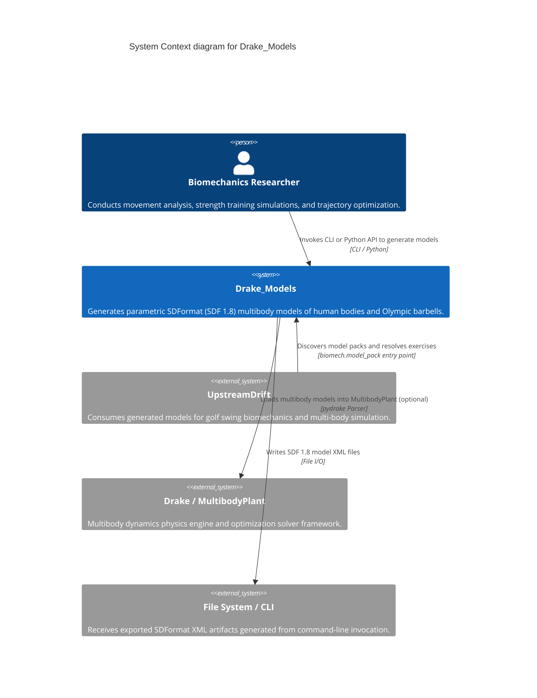
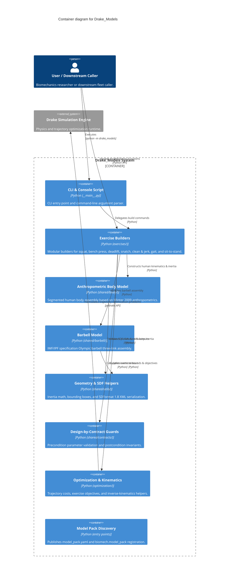

# Architecture Map — Drake_Models

This document defines the canonical Mermaid C4 architecture map for `Drake_Models`, providing verified context, container boundaries, capability-to-component traceability, and architecture change history.

## Context View (C4Context)

## Container View (C4Container)

## Feature Map

| Capability | Component | Interface | Evidence |
| --- | --- | --- | --- |
| Model Pack Discovery | `drake_models.shared` | `biomech.model_pack` entry point / `model_pack.yaml` | `tests/test_model_pack.py` |
| Anthropometric Body Modeling | `drake_models.shared.body` | `build_body_model()` / `BodyModelConfig` | `tests/unit/test_body_model.py` |
| Olympic Barbell Construction | `drake_models.shared.barbell` | `build_barbell_model()` / `BarbellConfig` | `tests/unit/test_barbell_model.py` |
| Back Squat Model Generation | `drake_models.exercises.squat` | `build_squat_model()` | `tests/unit/test_squat.py` |
| Bench Press Model Generation | `drake_models.exercises.bench_press` | `build_bench_press_model()` | `tests/unit/test_bench_press.py` |
| Deadlift Model Generation | `drake_models.exercises.deadlift` | `build_deadlift_model()` | `tests/unit/test_deadlift.py` |
| Snatch Model Generation | `drake_models.exercises.snatch` | `build_snatch_model()` | `tests/unit/test_snatch.py` |
| Clean & Jerk Generation | `drake_models.exercises.clean_and_jerk` | `build_clean_and_jerk_model()` | `tests/unit/test_clean_and_jerk.py` |
| Design-by-Contract Validation | `drake_models.shared.contracts` | `require()`, `ensure()` guards | `tests/test_drake_biomechanics_validation.py` |
| Drake Trajectory Optimization | `drake_models.optimization` | `DrakeTrajectorySolver`, exercise objectives | `tests/unit/test_optimization.py` |
| SDFormat 1.8 XML Generation | `drake_models.shared.utils` | `sdf_helpers.py`, `geometry.py` | `tests/unit/test_sdf_helpers.py` |

## Architecture Change Log

| Date | PR / Issue | Description |
| --- | --- | --- |
| 2026-09-10 | #1598 | Adopt maintainable Mermaid C4 architecture-map contract and automated CI verification |
